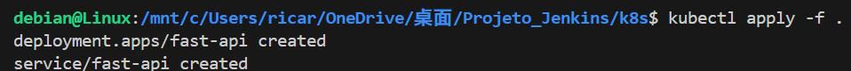
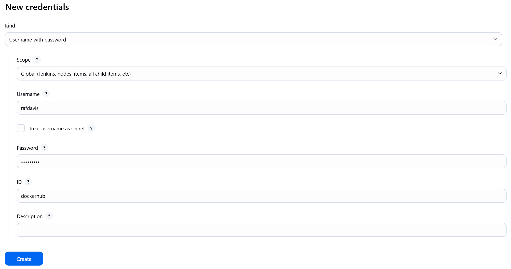
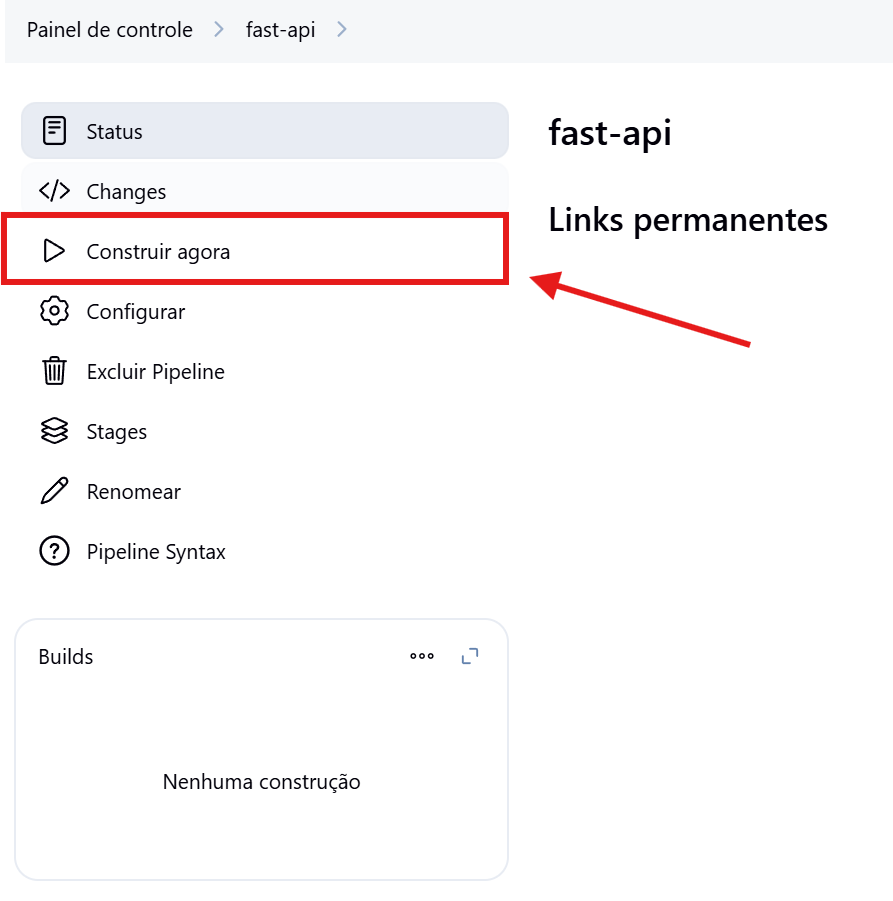

# Projeto_Jenkins

## Descrição:

O projeto tem como objetivo criar uma pipeline CI/CD utilizando as tecnologias FastAPI, Docker, Jenkins e Kubernetes. Fazendo a automação do deploy da aplicação no cluster Kubernetes local e o push da imagem da aplicação no Docker Hub.

## Tecnologias Utilizadas:

- FastAPI: Framework web em Python
- Docker: Para conteinerização da aplicação
- Docker Hub: Registro público de imagens
- Jenkins: Ferramenta de CI/CD
- Kubernetes local: Minikube, Docker Desktop

## Objetivos:

- Preparação do Ambiente
- Criar o Dockerfile e subir para o Docker Hub
- Criar o Deployment, Service e aplicá-los no cluster Kubernetes local
- Criar a pipeline no Jenkins para realizar o build e push da imagem Docker
- Configurar o Jenkins para acessar o cluster Kubernetes local e fazer o deploy no cluster.

## Etapa 1: Preparação do Ambiente para o Projeto

### Criação do repositório no GitHub

Acesse o [GitHub](https://github.com), selecione `New`


### Preencha as informações do seu repositório.


### Após isso, crie o repositório e adicione a aplicação

## Criação da conta no Docker Hub

### Acesse o [Docker Hub](https://hub.docker.com), selecione `Sign up`


### Após isso, realize o cadastro com as suas informações.


## Instalar o Kubectl, Minikube, Java, Jenkins e Docker Desktop

### Kubectl:

- 1. Adicione as chaves e os repositórios necessários:

```bash
sudo apt-get update
sudo apt-get install -y apt-transport-https ca-certificates curl gnupg

curl -fsSL https://pkgs.k8s.io/core:/stable:/v1.30/deb/Release.key | sudo gpg --dearmor -o /etc/apt/keyrings/kubernetes-apt-keyring.gpg
sudo chmod 644 /etc/apt/keyrings/kubernetes-apt-keyring.gpg
```

- 2. Adicione o repositório Kubernetes:

```bash
echo 'deb [signed-by=/etc/apt/keyrings/kubernetes-apt-keyring.gpg] https://pkgs.k8s.io/core:/stable:/v1.30/deb/ /' | sudo tee /etc/apt/sources.list.d/kubernetes.list
sudo chmod 644 /etc/apt/sources.list.d/kubernetes.list
```

- 3. Atualize os pacotes e instale o Kubectl:

```bash
sudo apt-get update
sudo apt-get install -y kubectl
```

### Minikube:

- Baixe os arquivos do Minikube e instale em seguida:

```
curl -LO https://github.com/kubernetes/minikube/releases/latest/download/minikube-linux-amd64
sudo install minikube-linux-amd64 /usr/local/bin/minikube && rm minikube-linux-amd64
```

### Para instalar o Jenkins é necessário o Java:

- 1. Atualize os pacotes e instale o Java JDK 17:

```bash
sudo apt update && sudo apt install openjdk-17-jdk -y
```

- 2. Com o Java instalado, adicione a chave do Jenkins ao sistema:

```bash
sudo wget -O /usr/share/keyrings/jenkins-keyring.asc \
https://pkg.jenkins.io/debian-stable/jenkins.io-2023.key
```

- 3. Adicione o repositório do Jenkins:

```bash
echo "deb [signed-by=/usr/share/keyrings/jenkins-keyring.asc] https://pkg.jenkins.io/debian-stable binary/" | sudo tee /etc/apt/sources.list.d/jenkins.list > /dev/null
```

- 4. Atualize os pacotes e instale o Jenkins:

```bash
sudo apt update && sudo apt install jenkins -y
```

### Configurando o Jenkins

- 1. Com o Jenkins instalado, visualize a senha inicial com o seguinte comando:

```
sudo cat /var/lib/jenkins/secrets/initialAdminPassword
```

- 2. Confira o Jenkins rodando localmente e cole a senha copiada:

``
http://localhost:8080
``


- 3. Selecione `Instalar as extensões sugeridas`:


- 4. Aguarde a instalação das extensões:


- 5. Criação do seu usuário Jenkins:


- 6. Mantenha a url padrão:


- 7. Configuração Finalizada:


### Docker Desktop:

- 1. Acesse [Docker Docs](https://https://docs.docker.com/desktop/setup/install/windows-install/) e selecione `Docker Desktop for Windows -x86_64`:


- 2. Entre no app e realize o login:


- 3. Com o Docker Desktop instalado, adicione o usuário atual e do Jenkins ao grupo Docker:

```
sudo usermod -aG docker $USER
sudo usermod -aG docker jenkins
```

- 4. Reinicie o Jenkins para aplicar as permissões no Docker:

```
sudo systemctl restart jenkins
```

## Verifique o acesso ao cluster Kubernetes local:

### Com as tecnologias instaladas, inicie o Kubernetes local:

#### Configure o Docker como driver padrão:

```
minikube config set driver docker
```

#### Inicie o Kubernetes:

```
minikube start
```


#### Com o minikube iniciado, confira o acesso ao Kubernetes:

```
kubectl get svc
```


## Validar execução local do uvicorn:

### Com a aplicação backend no seu repositório:

- Entre na pasta do repositório, baixe as dependências do requirements e rode o projeto:

```bash
cd backend
pip install -r requirements.txt
uvicorn main:app --reload --host 0.0.0.0 --port 8000
```

### A aplicação não possue um frontend, então verique se ela está rodando por meio da rota `/docs`:


### Selecione uma rota e teste a execução:


### Verique se retornou uma cor:


## Estrutura Sugerida para o Projeto:

```
Projeto_Jenkins/
├── backend/
│   ├── main.py
│   ├── requirements.txt
│   └── Dockerfile
│
├── k8s/
│   ├── deployment.yaml
│   └── service.yaml
│
└── Jenkinsfile
```


## Etapa 2: Conteinerização com Docker

### Criação do Dockerfile e publicação do container no Docker Hub:

- 1. Dentro da pasta backend crie o seguinte Dockerfile:

```
FROM python:alpine
WORKDIR /backend
COPY requirements.txt .
RUN pip install -r requirements.txt
COPY . .
EXPOSE 8000
CMD ["uvicorn", "main:app", "--host", "0.0.0.0", "--port", "8000"]
```

- 2. Após a criação, construa a imagem Docker com o seu usuário do Docker Hub:

```
docker build -t usuario/fastapi .
```


- 3. Com a construção feita, suba a imagem para o Docker Hub:

```
docker push usuario/fastapi
```


- 4. Confira no Docker Hub se o repositório foi criado com a imagem: 


## Etapa 3: Arquivos Deployment e Service no Kubernetes local:

### Criação do yaml de Deployment e Service e aplicá-lo no cluster local:

- 1. Crie uma pasta `k8s` e dentro dela crie os seguintes arquivos:

### deployment.yaml:

```
apiVersion: apps/v1
kind: Deployment
metadata:
  name: fast-api
spec:
  replicas: 2
  selector:
    matchLabels:
      app: fast-api
  template:
    metadata:
      labels:
        app: fast-api
    spec:
      containers:
        - name: fast-api
          image: usuario/fastapi
          ports:
            - containerPort: 8000
```

### service.yaml:

```
apiVersion: v1
kind: Service
metadata:
  name: fast-api
spec:
  type: NodePort
  ports:
    - port: 80
      targetPort: 8000
      nodePort: 30001
  selector:
    app: fast-api
``` 

### Com os arquivos criados e o cluster rodando localmente siga os passos:

- 1. Dentro da pasta `k8s` execute o comando:

```
kubectl apply -f . 
```



- 2. Confira se o Deployment e Service foram criados: 

```
kubectl get deploy,svc
```


- 3. Com o Deployment e Service criados, crie uma `url` para a aplicação:

```
minikube service fast-api --url
```


- 4. Copie o url e entre na rota `/docs` novamente:


## Etapa 4: Jenkins - Build e Push:

### Antes da criação da pipeline é necessário a instalação de Plugins:

- 1. Em `Painel de Controle -> Gerenciar Jenkins`:


- 2. Selecione `Plugins -> Extensões disponíveis`:


- 3. Selecione `Docker`, `Docker Pipeline` e `Kubernetes CLI`:


- 4. Aguarde a instalação dos Plugins:


### Criação do Jenkinsfile:

- Crie um Arquivo `Jenkinsfile`:
```
pipeline {
    agent any

    stages {
        stage('Build Docker Image') {
            steps {
                script {
                    dockerbuild = docker.build("user/fastapi:${env.BUILD_ID}", '-f ./backend/Dockerfile ./backend')
                }
            }
        }

        stage('Push Docker Image') {
            steps {
                script {
                    docker.withRegistry('https://registry.hub.docker.com', 'dockerhub') {
                        dockerbuild.push('latest')
                        dockerbuild.push("${env.BUILD_ID}")}
                }
            }
        }
```

### Criação de tarefa no Jenkins:

- 1. Dentro do Jenkins, selecione `nova tarefa`:


- 2. Nomeie a tarefa e selecione pipeline:


- 3. Na parte de Pipeline, selecione:

<br>

  - Definição: `Pipeline script from SCM`
  - Repository URL: O link do seu repositório
  - Branch Specifier: `*/main`
  - Script Path: `Jenkinsfile`


### Criação de Credencial:

### Docker Hub:

- 1. Selecione `Painel de Controle -> Gerenciar Jenkins -> Credentials`


- 2. Selecione o escopo `Global` e `Add Credentials`:


- 3. Preencha os campos:

<br>

  - Kind: `Username with password`
  - Scope: `Global`
  - Username: `Usuário do Docker Hub`
  - Password: `Senha do Docker Hub`
  - ID: `O mesmo utilizado no Jenkinsfile`



### Execução de Tarefa no Jenkins:

- 1. Selecione `Painel de Controle -> nome-tarefa -> Contruir Agora`:



- 2. Com a execução bem sucedida, confira se a imagem foi criada no Docker Hub:


### Automatização da pipeline pelo git push:

- 1. Em `Painel de Control -> nome-tarefa -> Configurar